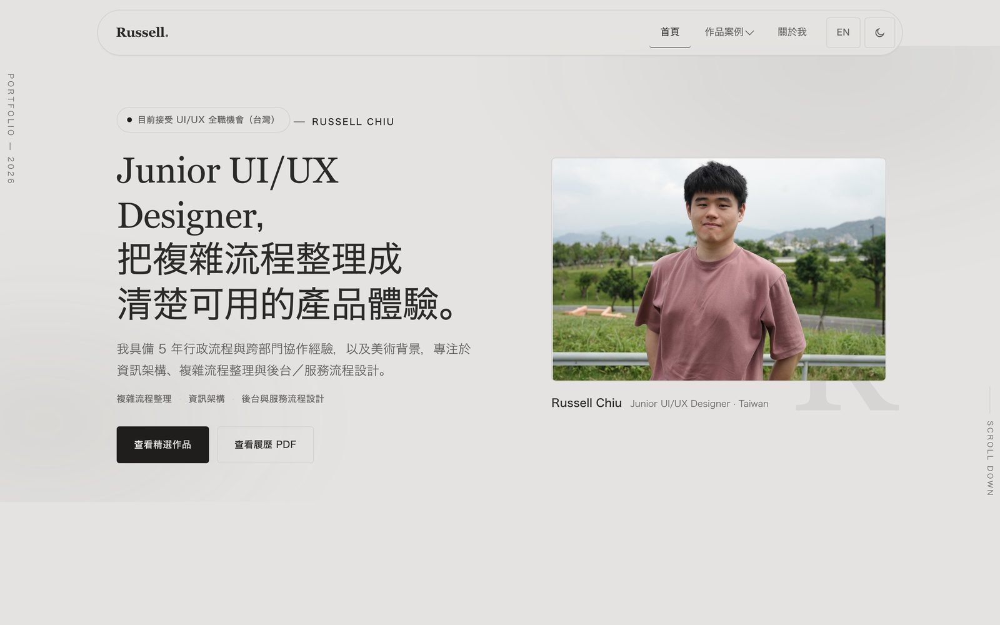
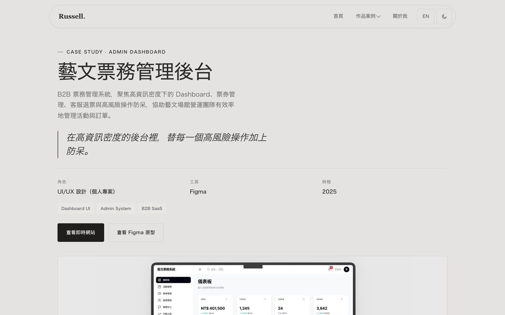

# Russell Chiu — Portfolio

Live Demo: https://russell06-web.github.io/
Case Studies: 5 個完整案例研究，見下方 Features

## Overview

Russell Chiu 的 Junior UI/UX Designer 作品集網站，收錄 5 個完整案例研究，涵蓋複雜後台系統、行動端體驗、公共服務網站、互動式網站實作與電商租購平台。

## My Role

UI/UX Design、Information Architecture、Front-End Implementation、Case Study Writing（個人專案）

## Key UX Focus

- 首頁 30 秒內傳達定位、強項與該優先看哪些作品
- 案例頁一致結構（背景／問題／研究／策略／決策／畫面／驗證／反思）＋ Case Snapshot 摘要區塊
- 誠實的研究方法揭露：明確區分真實訪談、ChatGPT 情境模擬與自我檢核，不誇大成效
- 雙語（中／英）切換、深色模式、RWD
- Open Graph／Twitter Card 分享預覽、favicon 等基礎專業細節

## Features

- 首頁：定位聲明、精選作品排序（3 張完整卡片＋2 張輕量卡片）
- 5 個案例研究頁：藝文票務管理後台、台灣好行 RWD、Volleyball Hub、GearLoop、MWR 世界宗教博物館
- About 頁：背景故事、工作方式、核心能力、經歷與教育
- 履歷 PDF 下載、LinkedIn／GitHub／Email 聯絡方式

## Validation

Playwright 自動化檢查：全站 7 頁 × 5 種寬度零水平溢出、零 console 錯誤；中英文 i18n key 全部對應無缺漏；所有外部連結（Figma 原型、5 個 demo 網站、GitHub、LinkedIn）皆以真實瀏覽器導航驗證可正常開啟。

## Limitations

個人作品集網站，5 個案例皆為轉職期間自主發起的概念設計練習，非正式商業產品或客戶案子。

## Tech Stack

HTML、CSS、JavaScript（無框架）、Claude Code

## Screenshots

